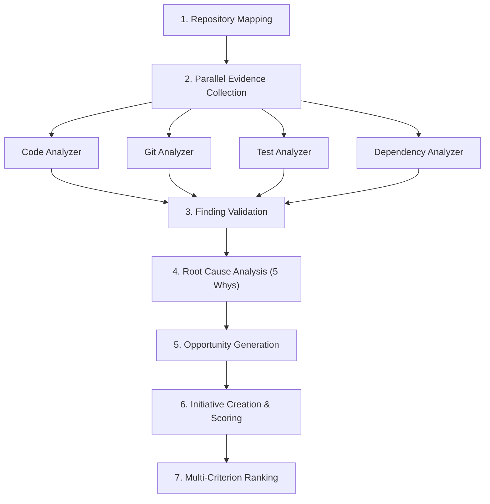

# Code Pro Max — Analysis Pipeline Architecture

> **Phase 1.2 — Complete Analysis Pipeline & Scoring**

---

## Overview

The Analysis Pipeline (`AnalysisPipeline`) is the top-level orchestrator of Code Pro Max. It coordinates repository mapping, evidence collection, finding validation, root cause analysis, opportunity generation, initiative creation, and multi-criterion ranking into a single unified execution pipeline.

---

## Pipeline Execution Stages



### Stage 1: Repository Mapping
- **Component:** `RepositoryMapper` (`src/core/algorithms/repository-mapper.ts`)
- **Action:** Scans the directory tree, classifies the repo type (`monorepo`, `monolith`, `library`), computes language distribution, identifies framework dependencies, and locates entry points.
- **Timeout:** Wrapped in a configurable timeout (default 15 minutes).

### Stage 2: Parallel Evidence Collection
- **Component:** `EvidenceCollector` (`src/analyzers/evidence-collector.ts`)
- **Action:** Runs 4 analyzers concurrently via `Promise.allSettled`:
  1. **Code Analysis:** Large functions, complexity, missing try-catch, high coupling, duplication.
  2. **Git Analysis:** High-churn files, dead code, repeated fixes, ownership bottlenecks.
  3. **Test Analysis:** Missing test suites, low test ratios, unhandled error paths, coverage gates.
  4. **Dependency Analysis:** Outdated, deprecated, or functionally redundant packages.

### Stage 3: Finding Validation
- **Action:** Filters out findings classified as `UNKNOWN` or lacking sufficient evidence to act upon.

### Stage 4: Root Cause Analysis
- **Component:** `RootCauseAnalyzer` (`src/analyzers/root-cause-analyzer.ts`)
- **Action:** Executes a 5-Whys analysis on each validated finding to uncover structural and process-level root causes, avoiding individual blame.

### Stage 5: Opportunity Generation
- **Component:** `OpportunityGenerator` (`src/services/opportunity-generator.ts`)
- **Action:** Converts findings and RCA results into outcome-oriented Opportunities with defined scopes, non-scopes, and measurable success criteria.

### Stage 6: Initiative Creation & Initial Scoring
- **Component:** `InitiativeFactory` (`src/services/initiative-factory.ts`)
- **Action:** Instantiates `Initiative` objects in `Proposed` state, deriving 6 scoring axes (`impact`, `confidence`, `urgency`, `leverage`, `cost`, `risk`) directly from evidence.

### Stage 7: Scoring & Ranking
- **Component:** `ScoringEngine` (`src/core/algorithms/scoring-engine.ts`)
- **Action:** Calculates final scores using the additive formula `round((Impact + Confidence + Urgency + Leverage + (6-Cost) + (6-Risk)) / 30 * 100)` and ranks initiatives with explicit tiebreakers.

---

## Failure Modes & Resilience

| Scenario | Behavior | Pipeline Status |
|---|---|---|
| Inaccessible repository | Mapping throws or times out | `FAILED` |
| One evidence collector fails | Remaining collectors complete; warnings recorded | `PARTIAL` |
| Single RCA fails | Finding skipped with recorded warning | `COMPLETE` / `PARTIAL` |
| Pipeline timeout (> 15 min) | Execution halted; partial results returned | `PARTIAL` (`timedOut: true`) |

---

## Programmatic API Usage

```typescript
import { AnalysisPipeline } from './src/core/analysis-pipeline.ts';

const pipeline = new AnalysisPipeline();

// Run full analysis with progress tracking
const result = await pipeline.runFullAnalysis('/path/to/repo', {
  timeoutMs: 900_000,
  onProgress: (step, detail) => {
    console.log(`[${step}] ${detail}`);
  },
});

console.log(pipeline.formatSummary(result));
```
